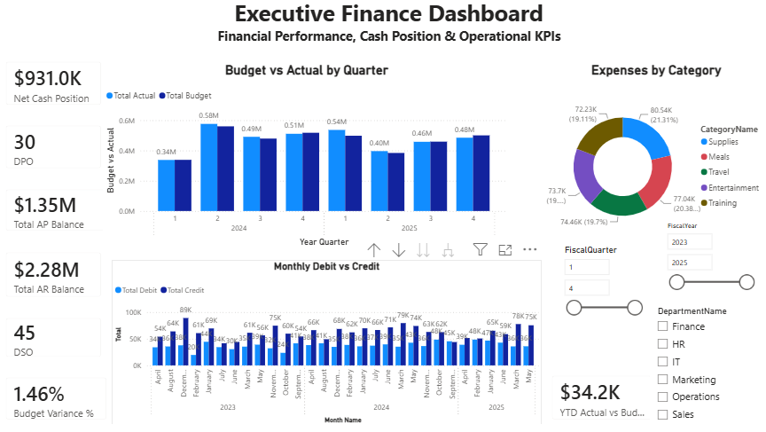
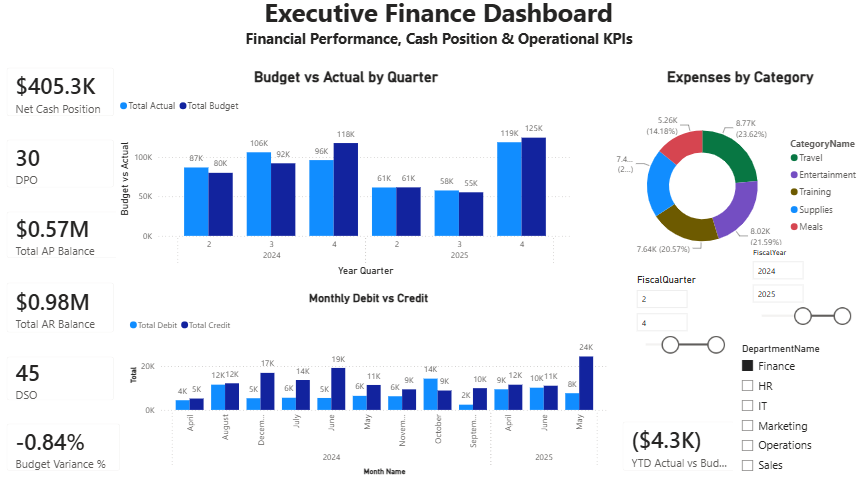
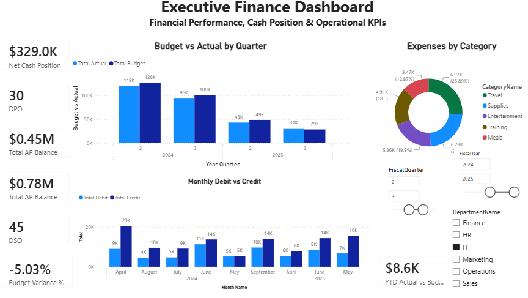

Finance Analytics Dashboard

An end-to-end finance analytics portfolio project built with SQL Server and Power BI. The project takes raw operational finance data through a full pipeline — from ingestion and data-quality validation, through a layered transformation process, into a dimensional (star-schema-style) model — and delivers an interactive executive dashboard for monitoring cash position, receivables, payables, budget performance, expenses, and general ledger activity.

Data Source

The source datasets used in this project (Accounts Payable, Accounts Receivable, Budget & Forecast, Expense Claims, General Ledger) were obtained from: https://excelx.com/practice-data/finance-accounting/

Dashboard Preview





Project Objectives
Consolidate finance data from multiple operational sources into a single warehouse.
Validate data quality before any reporting takes place.
Transform staging data through a cleansed layer into a star-schema-style analytical model.
Create reusable DAX measures for financial and operational KPIs.
Build an interactive executive dashboard with year, quarter, and department filters.
Present decision-ready insights as a complete, end-to-end portfolio project — from raw source file to final dashboard.
Dashboard KPIs
KPI	Purpose
Net Cash Position	Compares receivables with payables to indicate the current net position.
Total AR Balance	Shows the total outstanding accounts receivable balance.
Total AP Balance	Shows the total outstanding accounts payable balance.
DSO	Estimates the average number of days required to collect receivables.
DPO	Estimates the average number of days taken to pay suppliers.
Budget Variance %	Measures actual performance against budget as a percentage.
YTD Actual vs Budget	Shows the year-to-date difference between actual and budgeted amounts.
Total Expenses by Category	Analyses expense distribution across categories.
Total Debit and Total Credit	Tracks monthly general ledger debit and credit activity.
Dashboard Visuals
Six executive KPI cards
Budget vs Actual by Quarter — clustered column chart
Expenses by Category — doughnut chart
Monthly Debit vs Credit — clustered column chart
YTD Actual vs Budget — KPI card
Interactive filters for Fiscal Year, Fiscal Quarter, and Department
Data Sources

The project uses five finance datasets:

Accounts Payable
Accounts Receivable
Budget and Forecast
Expense Claims
General Ledger

The repository is intended for portfolio and educational use. Sensitive or confidential business data should not be committed to a public repository.

Data Architecture

The SQL solution follows a layered (medallion-style) approach:

Staging layer (stg) — stores the imported source data and load metadata, unmodified.
Data-quality checks — validates row counts, missing values, duplicates, date ranges, and unusual/outlier values.
Cleansed layer (silver) — standardises types, converts currencies to USD, and prepares validated records.
Data warehouse layer (dw) — provides fact and dimension tables (star schema) for Power BI.
Dimension Tables
DimDate
DimCurrency
DimVendor
DimCustomer
DimEmployee
DimDepartment
DimAccount
DimExpenseCategory
DimCostCenter
DimPaymentStatus
Fact Tables
FactAccountsPayable
FactAccountsReceivable
FactExpenseClaims
FactBudgetForecast
FactGeneralLedger
Data Model Notes
Dimension tables use surrogate keys.
Fact tables store monetary values in USD for consistent reporting, alongside the original amount and the exchange rate applied (for auditability).
DimDate is used as the central calendar dimension.
Multiple date roles (e.g. invoice date, due date, paid date) are handled with active and inactive Power BI relationships, using USERELATIONSHIP in DAX where required.
DAX measures use filter context to respond dynamically to report slicers.
Data Quality Notes

A data-quality log table (silver.DataQualityLog) was built into the pipeline to record anomalies found in the source data rather than silently correcting or hiding them:

General Ledger imbalance: total Debit and total Credit do not match in the source data. This is not a fully balanced double-entry ledger — likely a characteristic of the synthetic/sample dataset rather than a real accounting error. It is flagged for transparency and shown in the dashboard's Monthly Debit vs Credit chart rather than corrected.
Other checks performed during profiling (duplicates, null handling, statistical outliers via mean ± 3 standard deviations, date-range logic) came back clean across all five source tables.
Tools and Skills Demonstrated
SQL Server and SSMS
Data staging and transformation (ETL)
Data-quality validation and logging
Currency conversion / multi-currency handling
Dimensional modelling and star schema design (including role-playing dimensions)
Power BI data modelling
DAX measures
Financial KPI design
Dashboard development and data visualisation

## Repository Structure

```text
finance-analytics-dashboard/
├── README.md
├── images/
│   ├── financeanalytics.png
│   ├── financefilter1.png
│   └── financefilter2.png
├── powerbi/
│   └── FinanceAnalytics.pbix
└── sql/
    ├── 01_create_staging_tables.sql
    ├── 02_data_quality_checks.sql
    ├── 03_create_silver_tables.sql
    ├── 04_create_dimensions.sql
    ├── 05_create_fact_tables.sql
    └── 06_validation_queries.sql
```
    
How to Use This Project
Review and run the SQL scripts in numerical order in SQL Server.
Load the source data into the staging tables.
Run the data-quality and transformation scripts.
Refresh the Power BI file and confirm the SQL Server connection settings.
Use the dashboard filters to analyse results by fiscal period and department.
Key Insights Available

The dashboard enables users to:

Compare quarterly budget and actual performance.
Monitor receivable and payable balances.
Assess cash-position changes under different filter selections.
Identify the distribution of employee expenses by category.
Review monthly debit and credit movements.
Track collection and payment-cycle efficiency through DSO and DPO.
Author

Maxim Irinov Economics graduate focused on Data Analytics and Business Analysis, with experience in accounting, SQL, Power BI, Python, ETL, dimensional modelling, and KPI reporting.
